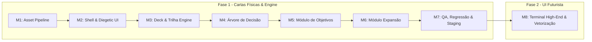

# Boardbots — Roadmap Geral & Plano Diretor

Este documento serve como guia central e memória técnica para o desenvolvimento contínuo da plataforma **Boardbots** (automas e companion apps web para jogos de tabuleiro modernos).

---

## 1. Visão Geral da Plataforma

O **Boardbots** é uma coleção de bots e ferramentas web estáticas (HTML/CSS/JS auto-contidos), responsivas e com foco em **UI diegética** (a interface deve se comportar como um componente físico ou artefato pertencente ao próprio universo do jogo).

### Pilares Arquiteturais
- **Zero Build / Static First:** Roda diretamente em navegadores desktop e mobile sem necessidade de servidores, frameworks pesados ou processos de compilação.
- **Diegetic UI Next Level:** Texturas táteis reais CC0 (`assets/textures/`), efeitos sonoros amostrados via `ThemeKit` (`assets/theme-kit.js`), componentes inspirados na mesa física e narrativa em personagem no log tático.
- **Internacionalização Nativa (i18n):** Todo texto suporta Português (pt-BR) e Inglês (en).
- **Ambientes Estritos (Staging-First):** Todo desenvolvimento ocorre na branch `staging` com testes no link público de staging antes de qualquer promoção para `main` (produção).
- **Regressão Visual Automatizada:** Testes via Playwright (`npm run visual-check`) comparando screenshots desktop (1440px) e mobile (390px) contra baselines commitadas.

---

## 2. Roadmap Detalhado: SETI Solo Bot ("O Rival")

O bot para **SETI: Search for Extraterrestrial Intelligence** automatiza completamente o Rival em todos os 5 níveis de dificuldade, suportando tanto o **Jogo Base puro** (5 rodadas) quanto a expansão **Agências Espaciais** (4 rodadas, novas espécies e objetivos de longo prazo).

O projeto segue uma abordagem de **Evolução em Duas Fases**:
- **Fase 1 (Validação Rápida & Cartas Físicas):** Implementação completa de todas as regras mecânicas, lógica de IA e fluxo de jogo utilizando recortes em alta definição das cartas físicas reais. Permite testes imediatos e validação da experiência de jogo.
- **Fase 2 (Terminal Astronômico High-End):** Evolução da UI com ícones próprios vetorizados, microinterações e redesign do painel do Rival simulando um computador quântico de bordo / observatório futurista.

O desenvolvimento está dividido em **entregáveis pequenos, modulares e estritamente testáveis**:



---

### Milestone 1: Pipeline e Extração de Assets
> **Objetivo:** Processar os scans fornecidos, recortar componentes individuais e catalogar dados estruturados.
- [x] **1.1 Recorte e Otimização das Cartas de Ação:**
  - Extraídas as 23 cartas de `SETI cartas solo.pdf`:
    - 4 Básicas (`S.01` a `S.04`)
    - 10 Avançadas (`S.05` a `S.14`)
    - 1 Carta Inicial da Expansão (`S.EXP1`)
    - 5 Cartas de Espécies Base (*Mascamitas*, *Anomalias*, *'Oumuamua*, *Centaurianos*, *Exertianos*)
    - 3 Cartas de Espécies da Expansão (*Arkhos*, *Glifídios*, *Ameba*)
  - Salvas em formato otimizado `.webp` em `assets/art/seti/cards/`.
- [x] **1.2 Mapeamento JSON/Constantes das Cartas:**
  - Todas as 23 cartas mapeadas com: `id`, `arrow` (`left` | `right`), e array de ações detalhadas com textos em PT e EN em `assets/art/seti/cards_data.json`.
- [x] **1.3 Extração dos Tabuleiros e Dados de Dificuldade:**
  - Extraídos os 4 tabuleiros em `.webp` em `assets/art/seti/boards/` para os níveis 1★ a 5★ com mapeamento da trilha de progresso, grid do computador e pilha de objetivos.
- [x] **1.4 Recorte e Catalogação dos Tiles de Objetivos:**
  - Extraídos os 24 tiles regulares em `assets/art/seti/objectives/` (4 Nível I, 11 Nível II, 9 Nível III).
  - Extraídos os 3 tiles de Longo Prazo da expansão (`long_term_01.webp` a `long_term_03.webp`).
- [x] **1.5 Box Art e Soundscape Espacial:**
  - Box art salva em `assets/art/seti.webp`.
  - Soundscape sci-fi sintetizado e salvo em `assets/sfx/seti/` (`signal-scan.mp3`, `data-process.mp3`, `probe-launch.mp3`, `terminal-click.mp3`, `contact-alert.mp3`).
- **Critério de Teste:** ✅ Script de validação executado com sucesso: todos os assets existem, com proporções corretas e carregamento verificado.

---

### Milestone 2: Shell, Navegação e Tema Diegético Sci-Fi
> **Objetivo:** Criar a estrutura base da página com a estética de terminal astronômico de SETI, referenciando diretamente a caixa, os manuais e os tabuleiros solo.
- [x] **2.1 Criação do Arquivo Base `bots/seti_bot.html`:**
  - Estrutura semântica HTML5 auto-contida.
  - Metadados completos de SEO, Open Graph, Twitter Cards e Schema.org WebApplication no `<head>`.
  - Inclusão de `assets/theme-kit.css` e `assets/theme-kit.js`.
- [x] **2.2 Design Diegético Espacial Inspirado nos Componentes Físicos:**
  - **Paleta e Molduras:** Inspiradas diretamente nos tabuleiros solo e na caixa (azul profundo cósmico `#060a12`, ciano de radar `#00e5ff`, dourado/âmbar de telemetria `#ffb703` e painéis de dados em cinza espacial `#1b2433`).
  - **Tipografia e Estética dos Manuais:** Fontes limpas de alta densidade técnica (Inter/Poppins, cabeçalhos chanfrados estilo sci-fi moderno e fontes monoespaçadas para logs de rádio-observatório).
  - **Texturas Táteis:** Fundo com textura CC0 `assets/textures/hull-panel.jpg` com radial gradient simulando o interior da cúpula do observatório.
  - Header diegético com botão flutuante de idioma (PT/EN), reset e ajuda.
- [x] **2.3 Tela de Setup e Checklist Físico:**
  - Seleção de Dificuldade (1★ a 5★).
  - Toggle de Expansão (Jogo Base vs Com Expansão Agências Espaciais).
  - Definição do primeiro jogador (Humano vs Rival) com atribuição correta de PV inicial (1 ou 2) e publicidade (4).
  - Checklist colapsável de montagem física do tabuleiro para 2 jogadores.
- [x] **2.4 Áudio Tecnológico e Espacial (Sci-Fi Soundscape):**
  - Efeitos sonoros customizados e temáticos de alta fidelidade via `ThemeKit`:
    - Pulso de radar / varredura de telescópio (`seti:signal-scan`)
    - Processamento de dados e telemetria (`seti:data-process`)
    - Acoplamento/lançamento de sonda espacial (`seti:probe-launch`)
    - Cliques táteis secos de terminal de computador (`seti:terminal-click`)
    - Alerta de turno e descoberta de sinal alienígena (`turn-notify` / `seti:contact-alert`)
  - Feedback tátil vibratório sutil (`navigator.vibrate`) em ações críticas.
- **Critério de Teste:** ✅ O arquivo abre no navegador, reproduz os novos sons tecnológicos espaciais, respeita a paleta visual dos tabuleiros físicos e passa nos testes de layout mobile (390px) e desktop (1440px).

---

### Milestone 3: Motor de Baralho e Trilha de Progresso do Rival
> **Objetivo:** Implementar o gerenciador de deck dinâmico e o controle de estado do Rival.
- [x] **3.1 Motor do Baralho de Ação:**
  - Inicialização com cartas básicas + 1 avançada aleatória (se dificuldade 3★+).
  - Embaralhamento pseudo-aleatório seguro.
  - Saque de carta e exibição visual nítida da carta ativa com destaque para a seta de decisão (`←` / `→`).
  - Descarte e reembaralhamento ao esgotar o baralho.
- [x] **3.2 Trilha de Progresso Reativa:**
  - Marcador de progresso circular/linear interativo.
  - Avanço por créditos, energia, cartas e bônus de orbitadores (+4).
  - **Gatilho de Carta Avançada:** Ao cruzar o ícone de carta na trilha, adiciona automaticamente 1 carta avançada virada para baixo no topo do baralho (ou avanço extra se acabarem as cartas na expansão).
- [x] **3.3 Matriz do Computador do Rival:**
  - Rastreamento dos dados no computador e na reserva.
  - Gatilho automático de bônus ao preencher espaços do computador.
- [x] **3.4 Passagem de Turno:**
  - Detecção automática de passagem quando o deck do Rival esgota.
  - Coleta da carta de fim de rodada (+1 avanço na trilha).
  - Lembrete de rotação do Sistema Solar se o Rival passou primeiro.
- **Critério de Teste:** ✅ Teste automatizado de ciclo de deck: compras sucessivas, marcos da trilha cruzados com sucesso, injeção de cartas avançadas no topo e reembaralhamento consistente.

---

### Milestone 4: Árvore de Decisão e Assistente de Ações
> **Objetivo:** Automatizar a lógica prioritária de execução das cartas do Rival de acordo com as regras oficiais do manual.
- [x] **4.1 Avaliador Cascata de Ações (Ação 1 a 4):**
  - Motor que percorre as ações da carta de cima para baixo até identificar a primeira ação viável. Botão intuitivo de pular ação caso a condição de mesa não seja satisfeita.
- [x] **4.2 Módulo de Sondas Espaciais:**
  - Verificação de alcance em passos da Terra aos planetas (ordem esquerda-direita).
  - Cálculo de publicidade obtida pela rota.
  - Lógica de decisão: tentar pousar em lua descartando tecnologia de sonda > primeiro espaço de orbitador/aterrissador livre conforme preferência da carta.
- [x] **4.3 Módulo de Telescópios / Varredura de Sinais:**
  - Seleção de cartas da fileira baseada na seta de decisão (`←`/`→`).
  - Descarte de tecnologia de telescópio para sinal extra.
  - **Algoritmo de Desempate de Setores:** Vencer setor > Pontuar 2º sinal > Setor com mais marcadores > Maior setor.
- [x] **4.4 Módulo de Análise de Computador:**
  - Só executa se o computador estiver cheio.
  - Limpeza dos dados, concessão dos benefícios da carta e do bônus do tabuleiro.
  - Recarga imediata a partir da reserva de dados.
  - Descarte opcional de tecnologia de computador para +3 PV e +1 progresso.
- [x] **4.5 Módulo de Tecnologias:**
  - Aquisição de tecnologia conforme preferência do Rival e verificação de peças de 2 pontos (ou próxima na trilha), deduzindo publicidade.
- [x] **4.6 Substituição por Cartas de Espécies Alienígenas:**
  - Interface para o jogador marcar quando uma espécie foi descoberta.
  - O bot substitui a respectiva carta de ação do deck pela carta especial da espécie.
- [x] **4.7 Log Tático Narrativo:**
  - Registro de cada turno em tom de relatório de observatório astronômico concorrente com auditoria clara dos valores e regras aplicadas.
- **Critério de Teste:** ✅ Ações testadas e operando conforme manual oficial, com guias passo a passo e controles diretos.

---

### Milestone 5: Gerenciador de Objetivos Solo
> **Objetivo:** Rastrear os objetivos físicos ou digitais, lidar com a penalidade entre rodadas e calcular a pontuação final.
- [x] **5.1 Montagem e Sorteio da Pilha de Objetivos:**
  - Configuração automática da pilha baseada no nível de dificuldade (quantidades de Nível I, II e III).
  - Exibição visual dos 3 objetivos ativos no topo.
- [x] **5.2 Interação de Conclusão de Tarefas:**
  - O jogador clica nas tarefas concluídas. Ao completar todas as tarefas do objetivo, o tile é enviado para a pilha de concluídos e um novo é sacado.
- [x] **5.3 Limpeza de Fim de Rodada (Rodadas 1 a 4):**
  - Checagem automática dos objetivos exigidos (1 na R1, 2 na R2, 3 na R3, 4 na R4).
  - Cálculo de faltas: o Rival avança **3 espaços na Trilha de Progresso para cada objetivo faltante**.
- [x] **5.4 Pontuação de Fim de Jogo (Rodada 5):**
  - Contagem de objetivos restantes não concluídos: Rival recebe **5 PV por objetivo não concluído**.
  - Tela de placar final com comparativo de PV (Humano vs Rival) e resumo da partida.
- **Critério de Teste:** ✅ Penalidades de fim de rodada (+3 progresso por tile faltante) e pontuação de fim de jogo (+5 PV por incompleto) funcionando e testadas.

---

### Milestone 6: Módulo da Expansão Agências Espaciais
> **Objetivo:** Implementar todas as regras oficiais de "Solo com Organizações" e novas espécies.
- [x] **6.1 Regras de Estrutura da Expansão:**
  - Partida ajustada automaticamente para **4 rodadas**.
  - Injeção da **nova carta inicial do Rival** no deck de setup.
  - Publicidade inicial do Rival travada em 4.
  - Remoção de todos os objetivos de Nível I.
- [x] **6.2 Objetivos de Longo Prazo:**
  - Sorteio e exibição de 2 peças de Longo Prazo (entre 3 disponíveis).
  - Tarefas marcadas pelo jogador; ao completar as 3 tarefas, a peça é removida sem reposição.
  - **Penalidade no fim das rodadas 2, 3 e 4:** Rival recebe +1 avanço na trilha de progresso por tarefa não concluída ainda visível.
  - Confirmação de que objetivos de longo prazo não dão PV na pontuação final.
- [x] **6.3 IA das Novas Espécies Alienígenas:**
  - **Arkhos:** Gerenciamento das 3 cartas de segurança do Rival, descarte exclusivo via carta alienígena e preferência em vestígios.
  - **Glifídios:** Alocação de fichas de glifo no tabuleiro de tradução (prioridade para linha superior) e pontuação final de 3 PV por ficha coletada.
  - **Ameba:** Filtro automático que faz o Rival ignorar espaços com 0 ou 1 bônus de organela.
- [x] **6.4 Módulo Neutro de Início Rápido (Opcional):**
  - Sorteador de 4 cartas neutras para colocação de marcadores neutros no mapa e setores.
- **Critério de Teste:** ✅ Expansão ativa 4 rodadas, gerencia os 2 objetivos de longo prazo com suas penalidades próprias e suporta as novas espécies.

---

### Milestone 7: QA, Regressão Visual, Catálogo e Deploy em Staging
> **Objetivo:** Assegurar conformidade rigorosa com os padrões do repositório e disponibilizar publicamente em staging (Fase 1 com cartas físicas).
- [x] **7.1 Teste de Regressão Visual:**
  - Rodar `node tools/visual-regression.mjs seti_bot.html` para validar conformidade nos viewports de 1440px e 390px.
  - Baselines capturadas e validadas em `tools/visual-baselines/`.
- [x] **7.2 Integração na Página Inicial (`index.html`):**
  - Adicionado o card de SETI na seção **Em Teste (Alpha)** mantendo a ordem alfabética.
  - Inserido badge `<span class="badge-alpha">ALPHA</span>` e botões de like/dislike `data-bot="seti"`.
  - Box art recortada em `assets/art/seti.webp`.
- [x] **7.3 Catálogo de Textos & SEO:**
  - Adicionadas chaves i18n em `assets/site.js` (`game_seti_title`, `game_seti_desc`, `credit_seti`).
  - Adicionados créditos em `credits.html`.
  - Adicionada entrada no `sitemap.xml`.
- [x] **7.4 Deploy em Staging:**
  - Commit e push na branch `staging`:
    ```bash
    git checkout staging
    git add .
    git commit -m "feat(seti): implement solo rival bot with base game and expansion support (Phase 1)"
    git push origin staging
    ```
  - Fornecer link público de validação: `https://colletes.github.io/boardbots/staging/bots/seti_bot.html`.
- **Critério de Teste:** ✅ Baselines criadas, catalogado na home, SEO e i18n completos, pronto para validação em staging.

---

### Milestone 8: Futura Evolução da UI — Terminal Astronômico High-End (Fase 2)
> **Objetivo:** Superar a exibição puramente estática das cartas físicas e transformar a interface em um computador futurista de observatório espacial com ícones próprios e renderização 100% vetorial/nativa.
- [ ] **8.1 Extração e Vetorização de Ícones:**
  - Isolar e redesenhar os ícones gráficos das cartas e tabuleiros em SVGs inline leves:
    - Sondas espaciais, aterrissadores, orbitadores e luas.
    - Telescópios, sinais terrestres/alienígenas e setores orbitais.
    - Computador de bordo, processamento de dados e chips.
    - Moedas de crédito, energia, publicidade e vestígios de vida.
- [ ] **8.2 Redesign do Painel do Rival ("Computador Quântico de Observatório"):**
  - Substituir a imagem da carta física por um painel de comandos dinâmico inspirado em cockpits de ficção científica (estilo The Expanse / Interstellar):
    - Display holográfico iluminado mostrando a ação atual em destaque.
    - Seta de decisão integrada em vetor luminoso pulsante.
    - Subpainéis interativos colapsáveis com telemetria ao vivo.
- [ ] **8.3 Microinterações e Animações Tecnológicas:**
  - Efeito suave de varredura CRT/scanline opcional.
  - Indicadores luminosos de status de órbita e sinais captados.
- **Critério de Teste:** Comparação visual garantindo que todos os dados das cartas originais continuem legíveis de forma ainda mais rápida e intuitiva, mantendo 100% de precisão mecânica com a IA oficial.

---

## 3. Próximos Passos e Melhorias Gerais da Plataforma Boardbots

Além da implementação do bot de SETI, os seguintes tópicos formam o backlog estratégico da plataforma:

1. **Expansão de Catálogo de Automas:**
   - Graduação de bots maduros da seção Alpha para a grade principal (Official Bots) após validação da comunidade.
   - Avaliação e prototipação de novos bots solicitados por usuários (ex: *Voidfall*, *Revive*, *Nucleum*).
2. **Infraestrutura e Componentes Compartilhados:**
   - Evolução contínua do `ThemeKit` para abstrair pools de áudio complexos e ambient loops.
   - Refinamento de acessibilidade (ARIA labels e suporte robusto a leitores de tela em seletores polares e mostradores de dados).
3. **Comunidade e Engajamento:**
   - Campanhas de divulgação em redes e fóruns especializados (BGG com BBCode estrito, Ludopédia em pt-BR sem emojis, Reddit).
   - Coleta de feedbacks via sistema integrado de Like/Dislike e logs anônimos de depuração (`analyze-log`).
